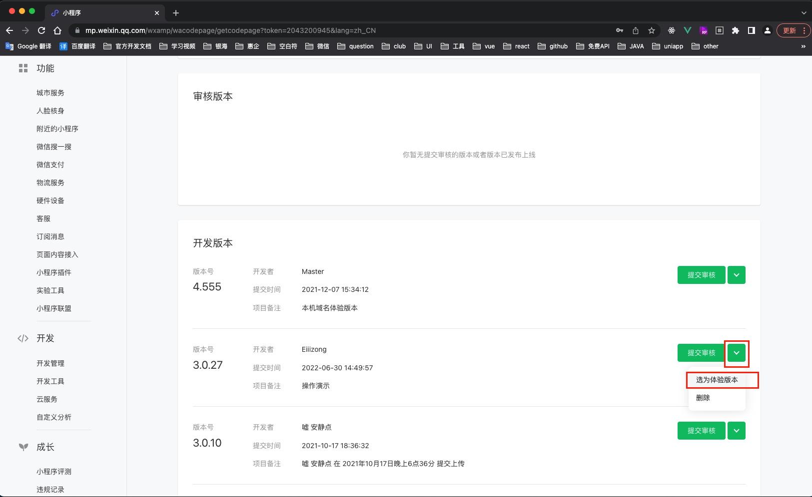
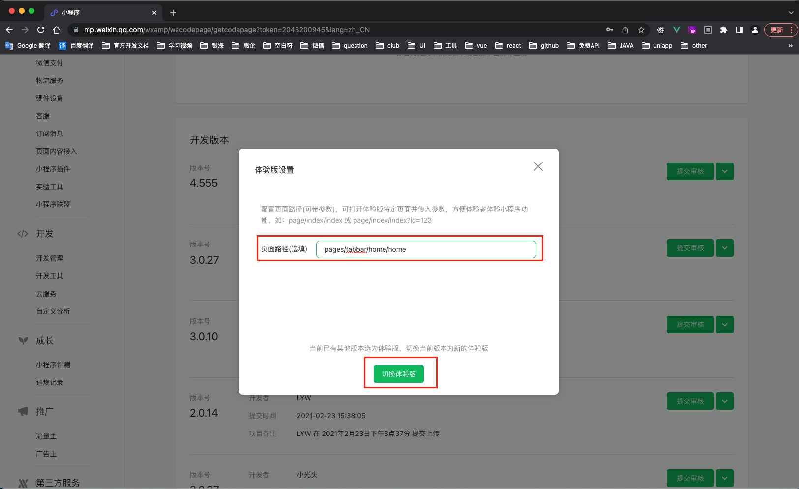
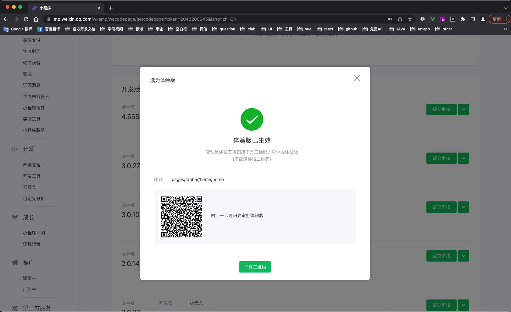

## 一卡通微信小程序-发布体验版说明文档

```tex
@Author: zengxm
@Date: 2022-06-30 10:41:28
@LastEditors: zengxm
@LastEditTime: 2022-06-30 10:52:12
```


> 该文档采用 `markdown` 语法编写，推荐使用软件 `typora` 浏览阅读 。[软件下载地址：https://www.typora.io/](https://www.typora.io/)


> **注意：该项目中公用的代码文件请不要随意更改提交到 SVN，提交前请确认。**
>
> **svn 地址：**[http://192.168.10.70:8090/svn/JY20SR00600/minifast/minifast_IPass](http://192.168.10.70:8090/svn/JY20SR00600/minifast/minifast_IPass)


 **注意：**执行下列步骤前先按照<b style="color:#f00">/minifast_IPass/doc/一卡通微信小程序-项目运行、打包发布说明文档.md</b>文档 中的 **`项目打包发行步骤`** 操作至上传到微信公众号平台步骤。再按照下列步骤执行。

### 


1. 选中版本，如下图所示点击<b style="color:#f00">选为体验版</b>。

   

   

2. 填写页面路径 <b style="color:#f00">pages/tabbar/home/home</b> ，不要随意更改该路径。点击  <b style="color:#f00">切换体验版</b> 按钮。如下图所示：

   

   

3. 如下图所示则表示设置成功，**有权限的人员**扫描该二维码即可访问。

   


