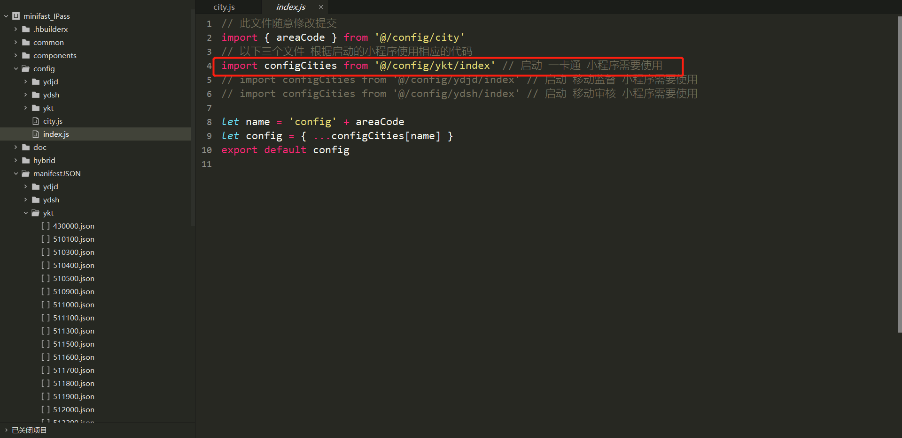
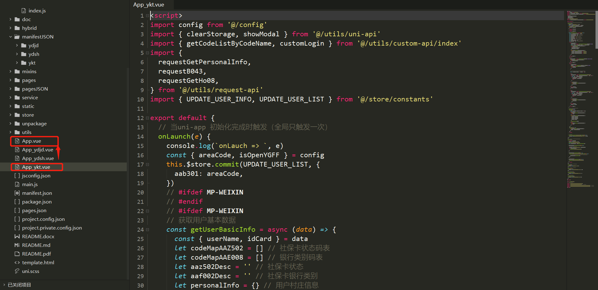
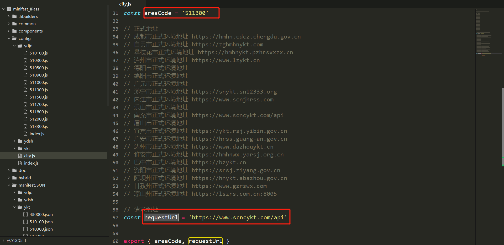
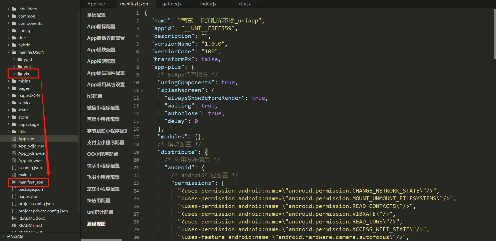

## 一卡通微信小程序地市切换说明文档

> 该文档采用 `markdown` 语法编写，推荐使用软件 `typora` 浏览阅读 。[软件下载地址：https://www.typora.io/](https://www.typora.io/)

> **注意：该项目中公用的代码文件请不要随意更改提交到 SVN，提交前请确认。**
>
> **svn 地址：**[http://192.168.10.70:8090/svn/JY20SR00600/minifast/minifast_IPass](http://192.168.10.70:8090/svn/JY20SR00600/minifast/minifast_IPass)

各地市第一次更新代码后，切换到自己项目所在地开发，具体步骤（以**南充** `511300` 为例）如下：

一卡通启动前提

#### 1、修改 `config/city.js` 文件

首先要确保启动的是一卡通，在 `config/index.js` 中进行切换，如图所示：

再将 `App_ykt.vue` 的内容复制到 `App.vue` 中。如图所示：

将 `areaCode` 更换为南充的行政区划代码 `511300`。将请求地址 `requestUrl`  更换为南充的地址，如图所示：

#### 2、更换 `minifest.json` 文件

将 `/minifestJSON/ykt/511300.json` 文件里的内容全部复制到 `minifest.json` 文件里面。 **若文件夹 `/minifestJSON/ykt` 下没有该地市的文件，请联系管理员添加**。如图所示：

#### 3、更换 `pages.json` 文件

将 `/pagesJSON/ykt/511300.json` 文件里的内容全部复制到 `pages.json` 文件里面。 **若文件夹`/pagesJSON/ykt`下没有该地市的后缀文件，请联系管理员添加**。如图所示：

按照上面步骤更改完成之后，在根据 <b style="color:#f00">一卡通微信小程序-项目运行、打包发布说明文档</b> 中`1、项目运行步骤` 重新启动程序。

**说明：**`config/city.js` 、`config/index.js` 、`mainfest.json` 、`app.vue`、 `pages.json`  这五个文件为项目运行时各地市自定义配置文件。`mainfest.json` 和`pages.json`  **文件的修改要及时同步到地市配置文件中**。例如：在项目开发过程中  `pages.json`  文件有修改，将其内容拷贝到  `pagesJSON/ykt/511300.json` 文件中，将  `pagesJSON/ykt/511300.json`  提交到 `svn`。 `pages.json`  则可以不用提交，防止其他地市更新代码冲突。`mainfest.json` 文件同理。

