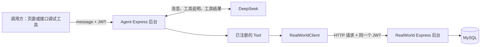

# RealWorld Agent 代码导读：开发思路、阅读顺序与一次请求的全过程

适用项目：`E:\面试项目\realworld-agent`  
对接后台：`E:\面试项目\express-backend2-realWorld`  
核对日期：2026-09-02，以当前工作区源码为准，包含尚未提交的代码。

这份文档的目标是：让你能说清楚每一层为什么存在，能顺着一次请求找到具体代码，并知道想修改某个行为时应该从哪里下手。

它与 [原有架构设计文档](E:/面试项目/realworld-agent/docs/realworld-agent-architecture.md) 的侧重点不同：原文主要讲整体规划，本篇主要讲**现在已经写出来的代码**。下文对“为什么这样拆分”的说明是根据当前结构解释设计取舍，不代表还原了当时每一步开发的历史。

建议分三次读，不必一次记住所有细节：

1. **第一次建立全貌**：读第 1～4 节，然后打开 `agent.runtime.ts` 和 `search-articles.tool.ts`。
2. **第二次跟着数据走**：读第 5～8 节，在编辑器里对照每一次函数调用。
3. **第三次自己验证**：读第 9～12 节，按调试顺序检查，并完成文末的小练习。

目录：

- [1. 当前项目究竟实现了什么](#s1)
- [2. 两个后台与大模型各自负责什么](#s2)
- [3. Agent 最核心的工作方式](#s3)
- [4. 推荐的代码阅读顺序](#s4)
- [5. 跟踪一次文章搜索请求](#s5)
- [6. 为什么要这样拆文件和传参数](#s6)
- [7. 阅读时容易卡住的 TypeScript 和框架写法](#s7)
- [8. Agent 与业务后台的数据契约](#s8)
- [9. 如果重新开发，应该按什么思路推进](#s9)
- [10. 如何启动、调试和定位问题](#s10)
- [11. 当前代码中需要特别注意的地方](#s11)
- [12. 自检练习和修改入口速查](#s12)

<a id="s1"></a>

## 1. 当前项目究竟实现了什么

一句话：**这是一个独立的 Agent 后台，通过大模型把自然语言问题转换成受限制的文章查询，再把查询结果组织成回答。**

`realworld-agent` 自己也是 Express 服务。它不是前端页面，也不是 RealWorld 原有业务后台的替代品。

| 能力 | 当前源码状态 | 判断依据 |
| --- | --- | --- |
| 接收聊天请求 | 已接入 `POST /api/agent/chat` | `app.ts` 挂载路由，`agent.route.ts` 定义 `/chat` |
| JWT 验证与转发 | 有运行逻辑，相关类型声明尚未补齐 | `auth.middleware.ts`、`realworld.client.ts` |
| 创建 DeepSeek 模型客户端 | 已编写 | `runtime/model.ts` |
| 文章搜索工具 | 已实现并注册，仍有字段和查询行为问题 | `search-articles.tool.ts`、`AgentRuntime.run()` |
| 查用户、文章详情、我的收藏、指定用户文章 | 只有空文件，尚未实现或注册 | 对应的四个 `.tool.ts` 文件为空 |
| 评论查询、关注列表、独立标签查询工具 | 当前未注册 | Runtime 的 `tools` 数组只有一个工具 |
| 跨请求保留聊天记忆 | 未实现 | 每次只传当前一条用户消息，没有会话存储配置 |
| 流式输出 | 未实现 | 当前使用 `invoke()`，完成后一次返回 JSON |
| RAG、向量检索、模型训练、多 Agent | 当前业务代码未实现 | 当前数据入口是 Tool 调用业务 HTTP API |
| 发布文章、删除、收藏等写操作 | 未开放给模型 | 只注册了查询工具 |

“已接入”表示代码链路存在，不表示已完成线上或真实模型联调。本次导读做了源码核对和本地类型检查，没有调用真实 DeepSeek 服务或连接数据库验证整条链路。当前类型检查的具体问题见第 11 节。

**读代码时判断一个工具能不能用，要看三个条件：有实现、被导出、被放进 `AgentRuntime.run()` 的 `tools` 数组。仅有文件名或架构文档中的描述不算。**

<a id="s2"></a>

## 2. 两个后台与大模型各自负责什么

### 2.1 先把三种职责分清

| 部分 | 负责的事 | 本项目中的例子 |
| --- | --- | --- |
| RealWorld 业务后台 | 用户登录、业务规则、查询数据库、组织业务数据 | 查询文章、统计收藏数、判断当前用户是否收藏 |
| Agent 后台 | 接收自然语言、验证身份、配置模型与工具、转发请求、整理回答 | 把“查一下 Node.js 文章”交给模型处理 |
| DeepSeek 模型 | 理解问题，生成工具调用参数，根据工具结果组织文字 | 选择 `search_articles`，生成 `keyword` 和分页参数 |

模型没有自动连接你的 MySQL，也不会因为你把项目叫作 Agent 就自动知道接口地址。接口地址、认证方式、返回结构，都需要我们用代码提供。



图中的 Tool 和 Client 都运行在 Agent 后台进程中。它们不是另外两个服务器。DeepSeek 和 RealWorld 后台是 Agent 调用的两类外部服务。

### 2.2 已经有业务接口，为什么还要 Agent

普通页面通常让用户填写搜索框、选择条件，再由前端按固定规则调用接口。Agent 增加了一种入口：用户用一句话表达需求，由模型把这句话转换成工具参数。

当前只有一个搜索工具，因此优势主要是自然语言入口和结果整理。工具增多后，才可能出现“先找到用户，再查他的文章”这样的多步组合。这个多步能力在原架构文档里有规划，当前项目还没有对应的完整工具集。

如果需求只是固定的关键词搜索框，直接调用文章接口也完全合理。选择 Agent 是为了学习并支持自然语言理解和后续工具组合，并不意味着所有普通业务请求都应该经过模型。

### 2.3 为什么 Agent 不直接查数据库

项目选择了复用业务 API：

- 文章、收藏等业务规则继续放在业务后台，不在两个项目里重复实现。
- 用户身份沿 HTTP 请求传给业务后台，业务后台继续执行对应接口的权限规则。
- 数据库表结构改变时，只要 API 契约稳定，Agent 的改动就可以较小。
- 模型能使用什么能力，由我们注册的工具决定。

这里有一个重要边界：**后台存在某个接口，不等于模型可以调用它。** 当前工具把请求路径固定为 `/api/articles/list`，模型不能通过工具参数自由填写任意 URL、SQL 或 HTTP 方法。

<a id="s3"></a>

## 3. Agent 最核心的工作方式

先认识五个词：

| 名称 | 在当前项目中的含义 |
| --- | --- |
| Model | `ChatDeepSeek` 对象，负责与模型服务通信 |
| Prompt | 给模型的行为说明，例如查询文章必须用工具 |
| Tool | 带名称、描述、参数规则和执行函数的能力入口 |
| Runtime | 我们自己的 `AgentRuntime` 类，负责组装并运行一次 Agent 请求 |
| Message | 一条对话消息；可能来自用户、模型或工具 |

一个 Tool 可以拆成四部分理解：

```text
name         模型用什么名字调用它：search_articles
description  告诉模型什么时候适合使用它
schema       允许提供哪些参数、参数格式是什么
执行函数      服务端实际执行的 TypeScript 代码
```

模型拿到的是工具名称、描述和参数定义等可调用信息。工具函数的具体代码仍然在你的服务器执行。

### 3.1 工具调用不是最终回答

模型可能先返回类似这样的结构，下面是便于理解的简化示意：

```json
{
  "name": "search_articles",
  "args": {
    "keyword": "Node.js 入门",
    "page": 1,
    "pageSize": 5
  }
}
```

这表达的是“请运行这个工具”。随后 Agent 框架执行我们写的函数，把结果交回模型，模型才有真实数据来组织回答。

```text
用户消息
→ 模型判断是否需要工具
→ 模型生成工具调用
→ 框架执行已注册工具
→ 工具查询业务后台并返回结果
→ 框架把工具结果交给模型
→ 模型继续调用工具，或生成最终回答
```

当前这段循环由 `createAgent()` 创建的 Agent 承担，所以你在业务代码里没有看到手写的 `while` 循环。`agent.invoke()` 也可能包含多次模型请求，不等于只调用一次 DeepSeek。

### 3.2 记住这三个核心位置

1. [agent.runtime.ts](E:/面试项目/realworld-agent/src/modules/agent/runtime/agent.runtime.ts)：`createAgent()` 和 `agent.invoke()`，负责把模型与工具接起来。
2. [search-articles.tool.ts](E:/面试项目/realworld-agent/src/modules/agent/tools/search-articles.tool.ts)：`tool()`，定义模型可以调用的文章查询能力。
3. [realworld.client.ts](E:/面试项目/realworld-agent/src/clients/realworld.client.ts)：`fetch()`，真正发出业务 HTTP 请求。

**模型选择能力，框架调度函数，函数访问接口。** 理解这三步，后面的 Express 分层就有了落点。

<a id="s4"></a>

## 4. 推荐的代码阅读顺序

阅读顺序与程序执行顺序可以不同。第一次先读对外输入输出，再读核心执行，比从所有 `import` 一路钻进依赖包容易理解。

| 顺序 | 打开的文件和重点 | 读完需要能回答的问题 |
| --- | --- | --- |
| 1 | [agent.schema.ts](E:/面试项目/realworld-agent/src/modules/agent/agent.schema.ts) | 用户传什么？最终返回什么？ |
| 2 | [agent.controller.ts](E:/面试项目/realworld-agent/src/modules/agent/agent.controller.ts) 的 `chat` | 如何取身份、校验输入、返回 HTTP 响应？ |
| 3 | [agent.service.ts](E:/面试项目/realworld-agent/src/modules/agent/agent.service.ts) 的 `chat` | 普通业务层如何调用 Runtime？ |
| 4 | [agent.runtime.ts](E:/面试项目/realworld-agent/src/modules/agent/runtime/agent.runtime.ts) 的 `run` | 有几个工具？如何把问题交给 Agent？ |
| 5 | [search-articles.tool.ts](E:/面试项目/realworld-agent/src/modules/agent/tools/search-articles.tool.ts) 的 `createSearchArticlesTool` | 模型参数怎样变成后台请求？ |
| 6 | [realworld.client.ts](E:/面试项目/realworld-agent/src/clients/realworld.client.ts) 的 `request` | URL、JWT、超时和错误如何处理？ |
| 7 | [业务后台 article.route.ts](E:/面试项目/express-backend2-realWorld/src/modules/article/article.route.ts) 的 `/list`，再到 Controller、Service、Repository | 请求最终如何查到 MySQL？ |
| 8 | [app.ts](E:/面试项目/realworld-agent/src/app.ts)、[server.ts](E:/面试项目/realworld-agent/src/server.ts)、[agent.route.ts](E:/面试项目/realworld-agent/src/modules/agent/agent.route.ts) | 前面那些对象是谁创建并连接起来的？ |
| 9 | [auth.middleware.ts](E:/面试项目/realworld-agent/src/common/middlewares/auth.middleware.ts)、[model.ts](E:/面试项目/realworld-agent/src/modules/agent/runtime/model.ts)、[system.prompt.ts](E:/面试项目/realworld-agent/src/modules/agent/runtime/system.prompt.ts) | 身份、模型配置和行为要求来自哪里？ |
| 10 | [env.ts](E:/面试项目/realworld-agent/src/config/env.ts)、[错误中间件](E:/面试项目/realworld-agent/src/common/middlewares/error.middleware.ts) | 配置不对或运行出错时，程序怎么处理？ |

第一轮可以略过 `extractFinalAnswer()` 的复杂类型声明、错误类中的原型处理，以及业务后台与文章列表无关的增删改方法。先读每个关键函数的参数、返回值和内部调用，再补语法。

<a id="s5"></a>

## 5. 跟踪一次文章搜索请求

假设用户已经从业务后台登录，发来：“查找标题为 Node.js 入门的文章，最多 5 条。”以下参数和文章数据是教学示例，不是本次真实接口调用结果，也不保证模型每次生成完全相同的参数。

### 第一步：调用方把消息和身份分别传入

```http
POST http://localhost:3001/api/agent/chat
Authorization: Bearer <业务后台登录返回的JWT>
Content-Type: application/json

{
  "message": "查找标题为 Node.js 入门的文章，最多 5 条。"
}
```

请求体提供问题，请求头提供身份。用户不需要在聊天内容里填写 Token 或用户 ID。

`app.ts` 的 `/api/agent` 与路由文件的 `/chat` 拼成完整路径。该路由先运行认证中间件，再运行 Controller。

### 第二步：认证中间件验证 JWT

实际执行的是 `createAuthMiddleware()` 返回的函数：

1. 从 `request.headers.authorization` 读取请求头。
2. 拆出 `Bearer` 和 Token。
3. 用 `jwt.verify(token, jwtSecret)` 验证签名和有效期等信息。
4. 用 Zod 检查解析出的 `id`、`exp` 是否是要求的数字。
5. 设置 `request.auth = { userId: authPayload.id, token }`。
6. 调用 `next()`，进入后面的处理函数。

这里的 `userId` 是从经过验证的 JWT 中取出的。用户在 `message` 中说“我是其他用户”不会改变它。

目前 Controller 只把 `request.auth.token` 继续传下去，没有把 `request.auth.userId` 传给 Runtime。业务后台会再次验证同一个 Token，从中得到自己的 `req.userId`。

### 第三步：Controller 校验 HTTP 输入

`AgentChatSchema.safeParse(request.body)` 要求：

- `message` 是字符串；
- 去掉首尾空白后至少 1 个字符；
- 最多 2000 个字符。

校验成功后使用 `result.data`，它已经经过 trim 等处理。然后调用：

```ts
this.agentService.chat(request.auth.token, result.data)
```

Controller 的工作到这里仍然是普通 HTTP 处理。它不需要知道如何调用 DeepSeek。

### 第四步：Service 把请求交给 Runtime

`AgentService.chat()` 的核心是：

```ts
const answer = await this.agentRuntime.run({
  message: input.message,
  token
})

return { answer }
```

这一层现在很薄。它把对外的用例“聊天”与具体的 Agent 执行实现隔开。

### 第五步：Runtime 为本次请求创建工具并执行 Agent

`AgentRuntime.run()` 依次做三件事：

```ts
const tools = [
  createSearchArticlesTool({
    realWorldClient: this.realWorldClient,
    token: input.token
  })
]

const agent = createAgent({
  model: this.model,
  tools,
  systemPrompt: AGENT_SYSTEM_PROMPT
})

const result = await agent.invoke({
  messages: [{ role: 'user', content: input.message }]
})
```

注意两个事实：`tools` 当前只有一个成员；`messages` 当前只有这次的用户消息。因此不能把它理解成已实现多工具或持久聊天记忆。

### 第六步：模型生成参数，工具完成转换

假设模型选择 `search_articles`，参数为：

```json
{ "keyword": "Node.js 入门", "page": 1, "pageSize": 5 }
```

工具函数用这些参数生成真正的业务请求：

```ts
realWorldClient.request({
  path: '/api/articles/list',
  method: 'POST',
  token,
  body: {
    page,
    pageSize,
    keyWord: keyword
  }
})
```

`keyword` 是模型工具的参数名，`keyWord` 是你自己的业务后台要求的字段名。工具负责适配两者。这里的 `token` 来自服务端创建工具时捕获的变量，不来自模型参数。

### 第七步：Client 发出 HTTP 请求

`RealWorldClient.request()`：

- 把 `baseUrl` 与 `path` 拼接起来；
- 自动设置 `authorization: Bearer ...`；
- 有请求体时设置 JSON 请求头并 `JSON.stringify()`；
- 用 `AbortSignal.timeout()` 限制这次业务请求的等待时间；
- 读取返回体并解析 JSON；
- 非成功 HTTP 状态或网络异常时包装为 `RealWorldApiError`。

本项目已经使用 `fetch()`。它返回的是 HTTP `Response` 对象；Client 会读出完整 JSON。后文工具代码中的 `response` 是解析后的 JSON，并不是 Axios 的自动包装对象。

### 第八步：业务后台查询文章

实际调用链如下，括号里是本次要找的方法：

```text
业务后台 app.ts：/api/articles
→ article.route.ts：/list
→ authMiddleware：验证 JWT，设置 req.userId
→ validateBody(ArticleListSchema)：校验并替换 req.body
→ article.controller.ts：list
→ article.service.ts：list(currentUserId, input)
→ article.repository.ts：articleList / articleCount / tagList
→ MySQL
```

重点看 [业务后台 Service 的 list](E:/面试项目/express-backend2-realWorld/src/modules/article/article.service.ts)：

1. 把 `page`、`pageSize` 换算成 SQL 的 `limit`、`offset`。
2. 用 `Promise.all()` 查询当前页文章和匹配总数。
3. 提取这一页的文章 ID，批量查询标签。
4. 用 `Map` 按文章 ID 归集标签，再挂到各篇文章上。
5. 把日期转换成字符串，生成分页结果。

标签单独批量查询，可以保持文章分页的单位是“文章”，避免一篇文章的多个标签把 JOIN 结果展开成多行后影响分页，也避免每篇文章单独再查一次标签。

在 [Repository](E:/面试项目/express-backend2-realWorld/src/modules/article/article.repository.ts) 中，`currentUserId` 用来计算每篇文章的 `favorited`，不是用来把列表限制为“当前用户发布的文章”。这是读代码时很容易混淆的一点。

### 第九步：工具校验结果，挑出模型需要的数据

工具收到后台 JSON 后，用 `ArticleListResponseSchema` 校验数据结构，再组织 `items` 和 `pagination`。

设计上保留标题、简介、作者名、标签、收藏状态、收藏数、slug 和时间等字段，**不把文章正文 `body` 放进返回给模型的结果**。这可以减少模型输入长度，也说明当前工具不足以支持全文分析。

注意：业务后台仍然返回了 `body`，工具也要求它通过 Schema 校验。只是最后发给模型的结果里没有正文。当前标签映射还有字段错误，详见第 11 节。

`return JSON.stringify(result)` 是把工具结果变成可交给模型读取的文本，不是直接返回给前端。

### 第十步：取最终回答，回到 HTTP 响应

模型读到工具结果后生成回答，`agent.invoke()` 返回消息集合。Runtime 的 `extractFinalAnswer()` 从后往前寻找：

1. 是模型消息 `AIMessage`；
2. 不再包含待执行的 `tool_calls`；
3. 能提取出非空文本。

找到后返回字符串。Service 包装成 `{ answer }`，Controller 再返回：

```json
{
  "success": true,
  "data": {
    "answer": "这里是模型根据工具结果整理的回答。"
  }
}
```

所以前端当前拿到的是回答文字，没有单独的文章卡片数组，也没有完整的内部工具调用记录。

<a id="s6"></a>

## 6. 为什么要这样拆文件和传参数

### 6.1 每一层各管一类变化

| 层 | 当前职责 | 为什么值得独立出来 |
| --- | --- | --- |
| Route | URL 与中间件排列 | 改接口路径不必改 Agent 执行逻辑 |
| Controller | HTTP 参数、响应、错误转交 | Runtime 不必依赖 Express 的 `request`、`response` |
| Service | 执行“聊天”用例，返回 `{ answer }` | 后续业务规则可以在这里组织 |
| Runtime | 模型、工具、提示词、执行与结果提取 | Agent 框架细节集中在这里 |
| Tool | 模型能力定义与业务数据适配 | 每种能力能独立描述、校验和维护 |
| Client | HTTP 地址、认证、超时、JSON、网络错误 | 多个 Tool 可以复用相同的通信方式 |
| 业务 Repository | SQL 与数据库读写 | 数据访问留在业务后台 |

**这种分层是为了管理变化，不是说少一层程序就不能运行。** 当前只有一个工具，Service 显得简单是正常的。是否继续增加抽象，应取决于实际需求，而不是照着目录数量扩张。

### 6.2 `app.ts` 是对象的组装位置

`createApp()` 先创建模型和 Client，再逐层把依赖交给其他对象：

```text
model + realWorldClient
          ↓
     AgentRuntime
          ↓
     AgentService
          ↓
    AgentController
          ↓
 Router + authMiddleware
          ↓
       Express app
```

这是依赖关系。处理请求时则是 Router → Controller → Service → Runtime，方向看起来相反，因为**先把底层能力准备好，上层才有东西可调用**。

例如 `new AgentService({ agentRuntime })` 就是在说：“Service 需要运行 Agent，这个能力由外部提供。”这叫依赖注入，当前使用普通构造函数手工完成，没有额外的注入框架。

好处是职责和依赖比较直观，也便于未来替换或隔离测试。当前类型有些直接引用具体类，做测试替身时仍需满足对应的类型约束，不能理解成已经提供了完整测试设施。

### 6.3 为什么 Tool 使用工厂函数

这句代码非常重要：

```ts
createSearchArticlesTool({ realWorldClient, token })
```

工厂函数的意思是“调用函数来创建一个新对象”。函数内部返回 Tool，同时让 Tool 执行函数记住这次传入的 `token`，这就是闭包。

```text
用户 A 的请求 → 创建 Tool A → 捕获 Token A
用户 B 的请求 → 创建 Tool B → 捕获 Token B
```

共享的是不保存当前用户 Token 的 Client；每次请求单独创建的是带该用户 Token 的工具。这样不用往全局变量里反复写“当前用户 Token”，可以避免这类共享状态导致的串号问题。

| 对象 | 当前创建时机 |
| --- | --- |
| Model、Client、Runtime、Service、Controller、Router | 每次调用 `createApp()` 时创建；正常启动导出的 app 时创建一套 |
| 带 Token 的 Tool、`createAgent()` 的结果 | 每次 `AgentRuntime.run()` 时创建 |
| 本次消息与结果 | 本次请求期间使用 |

Model 对象复用，不等于自动复用用户的对话记忆。当前传给 `invoke()` 的消息才是这次执行的输入。

### 6.4 为什么校验不止一次

当前有几条不同的输入边界：

```text
进程环境变量 → EnvSchema
HTTP 消息 → AgentChatSchema
JWT 解析结果 → JwtPayloadSchema
模型工具参数 → SearchArticlesInputSchema
业务 API 返回值 → ArticleListResponseSchema
```

每次校验回答的问题不同：配置是否齐全、用户输入是否合规、身份字段是否符合约定、模型参数是否可执行、后台返回是否能被工具正确理解。

TypeScript 只帮助检查代码里的类型关系，不能保证一个远程 HTTP 返回体真的符合接口。Zod 才是在运行时检查实际数据。两个后台都做参数校验，也是在分别守住自己的入口。

### 6.5 提示词与代码限制分别起什么作用

`system.prompt.ts` 告诉模型：使用工具查文章、不编造结果、不执行写操作、把文章内容当数据等。这些是行为要求。

代码上的限制更具体：只注册查询工具，工具固定 API 路径，Token 由服务端注入，参数受 Schema 限制，业务后台验证身份。

当前 Client 类型允许 `POST`、`PUT`、`DELETE` 等方法，默认方法也是 `POST`，所以“只读”不是 Client 类型系统强制的。当前注册工具实际调用的 `/api/articles/list` 是查询接口；HTTP 使用 POST 不代表业务上一定在修改数据。

不要把“Prompt 写了必须”理解成已经用程序保证模型每次都遵守。判断真实能力和权限时，要继续看工具实现及业务后台的规则。

<a id="s7"></a>

## 7. 阅读时容易卡住的 TypeScript 和框架写法

### 7.1 `interface`、类和构造函数分别是什么

以 `AgentService` 为例：

```ts
export interface AgentServiceDependencies {
  agentRuntime: AgentRuntime
}

export class AgentService {
  private readonly agentRuntime: AgentRuntime

  constructor(dependencies: AgentServiceDependencies) {
    this.agentRuntime = dependencies.agentRuntime
  }
}
```

可以逐句翻译：

- `interface`：约定传入对象必须有一个 `agentRuntime` 属性；它本身不会创建对象。
- `class`：定义服务对象有哪些数据和方法。
- `constructor`：`new AgentService(...)` 时运行，保存传进来的依赖。
- `private`：TypeScript 层面要求外部不要直接访问该成员。
- `readonly`：该属性赋值后不能随意重新指向另一个对象；不代表内部对象的所有状态都被冻结。
- `this.agentRuntime`：当前 Service 实例保存的 Runtime。

`Dependencies` 和 `Options` 都是项目作者选择的命名，分别强调依赖与配置，不是 TypeScript 的特殊关键字。

### 7.2 Controller 为什么使用箭头函数

路由注册时传的是函数引用：

```ts
options.agentController.chat
```

这个函数之后由 Express 调用。如果使用普通实例方法并直接把方法拿出来传递，调用时可能失去原来的 `this`。

当前写法：

```ts
readonly chat: RequestHandler = async (request, response, next) => {
  // 使用 this.agentService
}
```

箭头函数保留创建时的 `this`，因此内部还能访问当前 Controller 的 `agentService`。普通方法配合 `.bind(controller)` 也是一种办法；项目选用箭头函数避免每次注册时手动绑定。

### 7.3 `import type` 和 `.js` 后缀

- `import type { AgentService }` 表示这个导入只用于类型检查，不要求产生运行时导入。
- 源文件是 `.ts`，但导入路径写 `.js`，对应项目的 ESM 配置：`package.json` 使用 `"type": "module"`，`tsconfig.json` 使用 `NodeNext`；编译后运行的是 `.js` 文件。
- `rootDir: ./src`、`outDir: ./dist` 分别指定源码目录和编译输出目录。

所以看到 `./agent.service.js`，不用去 `src` 里寻找同名 JavaScript 文件。

### 7.4 `z.infer`、`parse` 和 `safeParse`

```ts
export type AgentChatInput = z.infer<typeof AgentChatSchema>
```

这是从 Zod Schema 推导 TypeScript 类型，减少手写一份类型与手写一份校验规则不一致的机会。

| 写法 | 成功时 | 失败时 |
| --- | --- | --- |
| `Schema.parse(value)` | 返回校验后的数据 | 抛出异常 |
| `Schema.safeParse(value)` | 返回含 `success: true` 和 `data` 的结果 | 返回含 `success: false` 和 `error` 的结果 |

Controller 使用 `safeParse`，因为它要把输入问题主动包装成带业务错误码的 400 响应。工具使用 `parse`，结构不符合约定时会抛出异常。

`optional()` 允许省略字段；`default(1)` 给缺省值；`nullable()` 允许 `null`；`passthrough()` 保留对象里未显式列出的字段。保留额外字段并不意味着额外字段一定存在，标签问题正与此有关。

### 7.5 `Promise`、`await` 与并发

`Promise<AgentChatOutput>` 表示异步操作完成后得到 `AgentChatOutput`。`await` 等待结果，再继续当前函数后面的处理。

Client 在等待 HTTP，Runtime 在等待 Agent 完成；业务后台的 `Promise.all([articleList(...), articleCount(...)])` 则允许两项互不依赖的查询并发执行。查标签依赖文章 ID，必须等文章列表出来之后再执行。

### 7.6 `unknown` 为什么不能直接 `.data`

Client 明确声明返回 `Promise<unknown>`，意思是：“我读到了某个 JSON，但还不知道它具有什么结构。”

所以在校验之前直接写 `response.data`，TypeScript 会报错。合理的处理思路是先用 Schema 校验整个 `response`，或先检查它确实是含 `data` 的对象，再访问属性。

当前工具文件恰好存在这个问题，第 11 节列出了实际检查结果。不要靠强行改成 `any` 来理解它；这里真正的问题是网络边界尚未完成类型收窄。

### 7.7 `extractFinalAnswer()` 那串类型在算什么

原代码中的类型表达式：

```ts
Awaited<
  ReturnType<
    ReturnType<typeof createAgent>['invoke']
  >
>['messages']
```

从里向外读：

1. `typeof createAgent`：取得这个函数的类型。
2. `ReturnType<...>`：取得它返回的 Agent 类型。
3. `['invoke']`：取出 Agent 的 `invoke` 方法类型。
4. 再一次 `ReturnType`：取得 `invoke()` 的返回类型。
5. `Awaited`：取出异步结果完成后的类型。
6. `['messages']`：取出结果里的消息数组类型。

它的目的只是让参数类型跟框架返回值保持一致，**不是在运行时调用这么多次函数**。第一遍可以把它读作“Agent 返回的消息数组”。

`extractTextContent()` 同时处理字符串和内容块数组，是因为模型消息的 `content` 可能不只是一段字符串。它收集可识别的文字，过滤空内容，再拼接成回答。

### 7.8 `next()` 与 `next(error)`

认证成功调用 `next()`，让 Express 继续下一个普通处理函数。Controller 出错时调用 `next(error)`，交给错误处理中间件。

`app.ts` 先注册正常路由，再注册 404，再注册错误中间件；如果顺序放反，请求可能在到达业务处理前就被当成不存在的接口。

<a id="s8"></a>

## 8. Agent 与业务后台的数据契约

“契约”就是双方约定的路径、请求字段和返回结构。这个项目最需要对照阅读的地方就是 Tool 与业务后台的文章列表接口。

### 8.1 请求字段如何转换

| 工具参数 | 业务后台字段 | 规则与区别 |
| --- | --- | --- |
| `keyword` | `keyWord` | 大小写不同；工具做转换；可省略，非空时最多 100 字符 |
| `page` | `page` | 默认 1，从 1 开始 |
| `pageSize` | `pageSize` | 工具默认 10、最多 20；后台默认 20、最多 100 |
| 无模型参数 | `Authorization` 请求头 | 来自当前请求的 JWT，由 Client 添加 |

工具的分页上限比后台更小，是一种控制模型输入规模的设计。后台能返回 100 条，不意味着每次都适合把 100 条文章交给模型。

当 `keyword` 省略时，请求体中的 `keyWord` 是 `undefined`，经 `JSON.stringify()` 后不会出现在 JSON 对象中。后台再把未提供的 `keyWord` 转为 `''`；当前 SQL 对它的处理有问题，见第 11 节。

### 8.2 后台返回的完整 JSON 与工具结果不同

下面是根据 Controller、Service、Mapper 整理的示例结构，数据为虚构：

```json
{
  "success": true,
  "code": "ARTICLE_FOUND",
  "message": "文章获取成功",
  "data": {
    "items": [
      {
        "id": 12,
        "title": "Node.js 入门",
        "description": "介绍 Node.js 的基础概念",
        "body": "这里是文章正文",
        "slug": "nodejs-intro",
        "author": {
          "author_id": 3,
          "username": "alice",
          "bio": null,
          "image": null
        },
        "tags": [
          { "article_id": 12, "tag_id": 2, "tag_name": "Node.js" }
        ],
        "favorited": 1,
        "favoritesCount": 4,
        "createdAt": "2026-09-01T08:00:00.000Z",
        "updatedAt": "2026-09-01T08:00:00.000Z"
      }
    ],
    "total": 1,
    "page": 1,
    "pageSize": 5,
    "totalPages": 1
  }
}
```

对照 [Mapper](E:/面试项目/express-backend2-realWorld/src/modules/article/article.mapper.ts) 可看到这些转换：

```text
SQL created_at / updated_at → 对象 createdAt / updatedAt → Service 转 ISO 字符串
SQL author_username 等列 → author 对象
SQL favorites_count → favoritesCount
标签查询别名 tag_name → 返回字段仍然叫 tag_name
```

工具接着进行第二轮裁剪和转换：

| 后台数据 | 工具处理 |
| --- | --- |
| 文章 `body` | 校验存在，但不放入最终工具结果 |
| `author` 的 ID、简介、头像 | 最终只保留 `username` |
| 数字 `favorited` | 用 `=== 1` 转为布尔值 |
| 分页字段 | 放到独立的 `pagination` 对象中 |
| 标签对象数组 | 意图转成标签名数组；当前取错字段，实际可能得到 `[null]` |

工具结果最后作为 JSON 文本交给模型。模型再把它组织成自然语言。不要把“业务接口 JSON”“工具结果 JSON”“聊天接口 JSON”当成同一个结构。

### 8.3 一眼区分三层返回值

```text
业务后台 → Client：
  { success, code, message, data: { items, total, page, pageSize, totalPages } }

Tool → 模型：
  JSON 字符串，内容为 { items: 裁剪后的文章, pagination: {...} }

Agent Controller → 调用方：
  { success: true, data: { answer: "最终文字" } }
```

`ArticleListResponseSchema` 本来写了一个联合结构：接受分页对象，或接受 `{ data: 分页对象 }` 并取出 `data`。但当前调用处提前访问了 `response.data`，所以不能据此宣称整个 Tool 已完整兼容这两种返回形式。

<a id="s9"></a>

## 9. 如果重新开发，应该按什么思路推进

以下是建议的学习和开发顺序，不是项目已经执行完的任务清单。核心原则是：先确定真实业务能力，再把能力交给模型。

### 阶段一：用普通 HTTP 请求验证业务契约

先确认 `POST /api/articles/list` 的认证、字段名和返回结构。给一个已知文章标题，能否拿到它？没有匹配结果时是否正常返回空列表？

这个阶段不需要大模型。否则一旦搜不到文章，就难以区分是模型参数错、Tool 转换错，还是 SQL 本身不符合预期。

### 阶段二：封装 Client

统一处理地址、Token、JSON 和超时。做到：用明确的 `path`、`body` 调用，就能收到后台返回值或明确错误。

不要在每个工具里重新复制一份 `fetch` 和认证请求头，否则以后后台地址、错误处理或超时策略变化，会到处修改。

### 阶段三：把一个查询能力封装成 Tool

先决定用户怎样描述需求，再设计少量明确参数。然后完成：参数校验 → 调用 Client → 校验后台返回 → 裁剪结果。

本项目的起点是文章查询，适合用来学习整条链路。先把它的字段和搜索语义对齐，比同时留下许多空工具更容易验证。

### 阶段四：让模型使用工具

配置模型、给工具清楚的名称和描述、写系统提示词，再通过 `createAgent()` 连接起来。

判断是否成功，不能只看“模型回答了一段话”，而要确认：调用了哪个工具、参数是什么、后台返回了什么、回答是否与结果一致。

### 阶段五：完成 HTTP 入口与身份传递

把 Runtime 接到 Service、Controller、Route，补上 JWT 验证、输入校验和统一错误格式。确认两名用户各自查询时，工具转发的是各自的 Token。

项目现在已经写了这条结构，后续应先补齐类型和契约问题。

### 阶段六：按真实需求扩展

例如要增加“读取文章全文”工具，可以依次处理：

1. 核对后台 `/api/articles/detail` 的请求和返回；当前详情返回结构与列表结构不同，不能直接复制列表 Schema。
2. 在空的 `get-article-detail.tool.ts` 中实现工具，以 `slug` 等经确认的业务参数调用 Client。
3. 在 `tools/index.ts` 导出工厂函数。
4. 在 Runtime 的 `tools` 数组创建并注册它，注入本次请求的 Token。
5. 调整工具描述与 Prompt，让模型知道列表查询和全文读取分别适用于什么问题。
6. 验证“先搜索获得 slug，再读取详情”的调用过程。

只改 Prompt 或只新增一个文件，都不会自动产生能力。对于“我的收藏”这样的功能，还要把“我”的身份从可信请求上下文传入；让模型填写一个任意 `userId` 不等于当前用户查询。

<a id="s10"></a>

## 10. 如何启动、调试和定位问题

### 10.1 先看配置来源

Agent 的配置集中在 [env.ts](E:/面试项目/realworld-agent/src/config/env.ts)。下表记录的是当前源码默认值，不代表你的 `.env` 实际取值，也不代表已验证远程模型可用性。

| 环境变量 | 当前要求或默认值 |
| --- | --- |
| `NODE_ENV` | 默认 `development` |
| `PORT` | 默认 `3001` |
| `REALWORLD_API_URL` | 必填；本地后台对应 `http://localhost:3000`，此处不要再加 `/api` |
| `JWT_SECRET` | 必填，至少 32 字符；必须与业务后台签发 JWT 所用的值一致 |
| `DEEPSEEK_API_KEY` | 必填，用于模型服务认证 |
| `DEEPSEEK_BASE_URL` | 默认 `https://api.deepseek.com` |
| `DEEPSEEK_MODEL` | 源码默认字符串为 `deepseek-v4-flash` |
| `REALWORLD_API_TIMEOUT_MS` | 默认 `10000`，用于业务 HTTP 请求 |
| `DEEPSEEK_TIMEOUT_MS` | 默认 `30000`，传给模型客户端 |
| `DEEPSEEK_MAX_RETRIES` | 默认 `2`，传给模型客户端 |

`REALWORLD_API_URL` 不加 `/api`，是因为工具路径已经包含 `/api/articles/list`。Client 只负责拼接，不会自动去重中间的路径。

业务后台数据库配置见 [pool.ts](E:/面试项目/express-backend2-realWorld/src/database/pool.ts)：`DB_HOST`、`DB_PORT`、`DB_USER`、`DB_PASSWORD`、`DB_NAME`。数据库账号配置属于业务后台；Agent 的认证配置与模型 Key 各有用途。

当前 `.env.example` 是空文件。复制它不会自动获得完整配置。配置时请对照上表和已有本地环境，本文没有读取或复制实际密钥。

### 10.2 两个进程分别启动

以下是在已安装依赖、配置好环境的本地终端里使用的脚本。它们是操作指引，本次文档核对没有启动这两个服务。

终端一，启动业务后台当前的 TypeScript 入口：

```powershell
Set-Location 'E:\面试项目\express-backend2-realWorld'
npm run dev2
```

该后台 `src/app.ts` 直接监听 `3000`。`npm run dev` 指向 `src/app.js`，阅读当前 TypeScript 实现时应使用 `dev2`。

终端二，启动 Agent：

```powershell
Set-Location 'E:\面试项目\realworld-agent'
npm run dev
```

Agent 的开发脚本是 `tsx watch src/server.ts`。类型检查与编译分别是：

```powershell
npm run typecheck
npm run build
```

`tsx` 能运行代码，不表示 TypeScript 类型检查已经通过。当前类型检查有 4 处错误，先了解第 11 节，不要把这些报错当成你操作步骤有误。

### 10.3 按三层验证，不要一上来只问模型

**第一层：确认 Agent 进程能响应。**

```powershell
Invoke-RestMethod -Uri 'http://localhost:3001/health'
```

预期是 `{ success: true, data: { status: 'ok' } }`。这个接口不验证 JWT，也不查询数据库或调用模型；健康检查成功只说明这个 Express 路由可以响应。Agent 启动本身仍然需要通过环境变量校验。

**第二层：直接检查业务后台。**

业务后台登录接口是 `POST /api/users/login`，请求体使用 `username`、`password`，Token 在响应的 `data.token`。有 Token 后先用接口调试工具请求：

```http
POST http://localhost:3000/api/articles/list
Authorization: Bearer <你的JWT>
Content-Type: application/json

{ "keyWord": "一个实际存在的完整文章标题", "page": 1, "pageSize": 5 }
```

这里先用完整标题，是为了避开当前代码尚未补齐“包含关键词”语义的问题。如果直接请求后台都没有结果，先检查后台查询与数据。

**第三层：请求 Agent。**

再发送第 5 节的 `/api/agent/chat` 请求，并观察模型参数与工具结果是否对应。测试“不存在的标题”时，回答应说明没有匹配数据；若用户要求发布文章，当前助手应说明不支持。

这些是建议的验证场景，不是本文宣称已经通过的测试结果。

### 10.4 适合放断点的位置

| 位置 | 重点观察 |
| --- | --- |
| Agent Controller，校验完成之后 | `result.data.message` 是否符合用户输入 |
| Runtime，创建工具之前 | 这一请求是否拿到了正确上下文；不要把完整 Token 输出到日志 |
| Tool 的异步函数第一行 | 模型实际生成的 `keyword`、`page`、`pageSize` |
| Client，`fetch` 前后 | 请求 URL、方法、业务参数、HTTP 状态 |
| 业务 Service 的 `list` | `keyWord`、`limit`、`offset`，是否与预期相同 |
| Tool，Schema 校验之后 | `articlePage.items` 与标签的实际字段名 |
| Runtime，`agent.invoke` 完成之后 | 消息里有哪些工具调用，最后是否有可提取的回答 |

### 10.5 常见现象对应哪一层

| 现象 | 优先检查 |
| --- | --- |
| 进程启动就失败 | 环境变量校验、依赖、端口；启动期异常还没进入 HTTP 错误中间件 |
| 401 / `UNAUTHORIZED` | Agent 请求头、JWT 是否过期、双方密钥是否一致 |
| 400 / `INVALID_AGENT_MESSAGE` | `message` 类型、是否为空、长度 |
| 404 / `ROUTE_NOT_FOUND` | 是否请求了 `/api/agent/chat`，HTTP 方法是否为 POST |
| `REALWORLD_API_FAILED` | 业务后台地址、状态码、JSON 格式、超时或网络异常 |
| `AGENT_EXECUTION_FAILED` | 逃出 Agent 执行过程的非 `AppError` 异常，或没有最终文本 |
| 回答“没有文章” | 先对照实际工具参数和后台查询结果，不急着修改 Prompt |
| 有文章但标签为空或为 `null` | Tool 的 `tag.name` 与后台 `tag_name` 是否一致 |
| 追问“那第二篇呢”答非所问 | 当前没有跨请求会话历史 |

`RealWorldApiError` 与 `AgentExecutionError` 的对外状态码都是 502。Client 会把收到的后台 HTTP 错误放入原因中，并不原样透传后台状态码。

还要区分异常和工具消息：工具调用中的部分错误可能被 Agent 框架处理并交回模型；只有真正向外抛出的异常才会走 Runtime 的 `catch` 和 Express 错误中间件。因此不能看到一个最终自然语言回答，就认定内部所有步骤都成功。

<a id="s11"></a>

## 11. 当前代码中需要特别注意的地方

这一节把“设计意图”和“当前代码实际状态”分开，避免你把待补齐的实现当作必须照搬的写法。本次只新增导读文档，没有修复这些源码问题。

### 11.1 已实际确认的类型检查错误

本次使用项目本地 TypeScript 编译器执行了 `--noEmit`，对应 `typecheck` 脚本的检查内容，退出码为 1，共报告 4 处错误：

| 位置（核对时行号） | 报错 | 原因 |
| --- | --- | --- |
| `auth.middleware.ts:76` | TS2339：`Request` 没有 `auth` 属性 | 给请求对象设置了自定义属性，但类型没有扩展 |
| `agent.controller.ts:27` | TS2339：同上 | 读取 `request.auth` |
| `agent.controller.ts:43` | TS2339：同上 | 读取 `request.auth.token` |
| `search-articles.tool.ts:149` | TS18046：`response` 是 `unknown` | 在 Schema 校验之前访问了 `response.data` |

`src/type/express.d.ts` 当前为空，所以它的存在尚未起到声明扩展的作用。可以理解为“预留了应该放类型声明的地方，还没有写完”。

第二个问题的调整方向是先验证外部返回值，再取得类型明确的数据。由于现有 `ArticleListResponseSchema` 已接受 `{ data: ArticlePage }` 并做转换，后续可评估让它直接校验整个 `response`，使包装层处理集中在 Schema 内。

### 11.2 标签字段不一致

后台查询、Mapper 和工具的 `TagSchema` 都定义了 `tag_name`，但工具映射时写的是：

```ts
tags: article.tags.map((tag) => tag.name)
```

正常后台返回没有 `name` 字段，这里会得到 `undefined`。数组中的 `undefined` 经 `JSON.stringify()` 会变成 `null`，所以模型可能读到 `"tags": [null]`。

这是字段适配问题，调整方向是读取经 Schema 校验的 `tag_name`。它没有出现在这次类型错误列表里，因为 `TagSchema.passthrough()` 保留了额外属性的可能性；类型检查不通过与运行结果不正确，是两类需要分别观察的问题。

### 11.3 关键词查询的描述与实际 SQL 不一致

工具说“包含某个关键词的文章”，参数说明还提到匹配文章内容；但当前 Repository 的过滤是：

```sql
WHERE a.title LIKE ?
```

参数直接传 `keyWord`，Service 和 Repository 都没有补上 `%` 通配符，也没有搜索 `body` 或 `description`。

因此从源码可推得：

- 普通关键词 `Node.js` 不会自动变成 `%Node.js%`，没有通配符时不具备“标题包含该词”的查询语义。
- 不传关键词会在 Service 里变成 `''`，最后得到 `LIKE ''`，不是“列出全部文章”。
- 标题的大小写等比较细节还与数据库排序规则有关，不能把这里理解成严格逐字节比较。
- `articleCount()` 使用同样的过滤方式，总数也受影响。
- `ArticleListSchema` 接受 `tag`、`author`，但当前 `list()` 没有把它们用于查询；工具本身也没有暴露这两个参数。

调整方向是先在后台定义清楚“无关键词”和“包含关键词”的业务行为，让列表和总数使用一致规则，再对齐工具描述。不要依赖模型主动填入 SQL 通配符来弥补业务接口语义。

### 11.4 存在文件或辅助代码，但没有进入当前执行路径

| 位置 | 当前情况 |
| --- | --- |
| 四个其他 `.tool.ts` 文件 | 空文件；Runtime 也未注册它们 |
| `request-id.middleware.ts` | 空文件；`app.ts` 没有挂载请求 ID 中间件 |
| `src/type/express.d.ts` | 空文件；未完成 Express 类型扩展 |
| `.env.example` | 空文件；尚不能充当配置模板 |
| 认证文件里的 `extractBearerToken()` | 已定义但未调用；实际走中间件中的 `authorization.split(' ')` |
| `error.middleware.ts` 中另一个 `notFoundMiddleware` | 有重复定义；`app.ts` 实际导入独立的 `not-found.middleware.ts` |

例如，未使用的 Token 提取函数做了 trim 和大小写处理，但实际认证分支要求 `type === 'Bearer'`。解释当前行为时，应沿真实调用路径读，不要只看到辅助函数就认为它生效了。

### 11.5 配置与执行范围还有这些边界

- `env.ts` 在模块加载时就执行 `EnvSchema.parse(process.env)`；`server.ts` 又调用 `loadEnv(process.env)`。因此当前会校验两次，配置缺失可能先在模块导入阶段抛出原始 Zod 错误，而不是走 `loadEnv` 的自定义错误说明。
- `model.ts` 配置 `temperature: 0` 和关闭 thinking 的参数；这是本项目的模型请求配置，不保证模型每次回答或工具选择完全一样。
- 业务 HTTP 超时与模型客户端超时分别生效；项目没有显式设置整个聊天请求的统一总时限。多次模型调用、工具调用和重试会增加总耗时。
- 当前只有本轮运行期间的消息，没有 `threadId`、历史消息输入、检查点或持久化存储。前端即使显示了聊天记录，也不会自动把历史交给这个接口。
- Prompt 要求优先提供标签、不能编造，但底层工具必须先返回正确数据，提示词才有可靠依据。

<a id="s12"></a>

## 12. 自检练习和修改入口速查

### 12.1 阅读时给每个函数写四句话

不必给每一行写注释。先在笔记里回答：

```text
谁调用我？
我收到了什么？
我调用了谁、做了什么转换？
我把什么返回给谁？
```

例如 `createSearchArticlesTool`：Runtime 调用它，传入 Client 和本次 Token；它返回一个可供模型调用的 Tool。真正搜索发生在 Tool 的异步执行函数被框架调用时，不是在创建 Tool 的那一刻。

### 12.2 不改代码也能做的五个练习

1. **画出身份路径。** 从业务后台 `sign({ id })` 开始，找到 Agent 验证、Tool 捕获、Client 转发和业务后台再次验证的位置。检查模型有没有机会直接填写 Token。
2. **追踪一个字段。** 追踪 `keyword → keyWord → SQL 参数`，再追踪 `tag_name → Tool 标签数组`，找出字段不一致发生在哪里。
3. **区分三种消息。** 在 Runtime 返回的消息中寻找用户输入、模型的工具调用、最终模型文字。说明为什么不能简单拿任意一条 `AIMessage` 就返回。
4. **解释分页。** `page = 2`、`pageSize = 5` 时，`offset = 5`，SQL 跳过前 5 条再取最多 5 条；当前排序依据是文章创建时间降序。
5. **判断功能是否已经实现。** 用户说“把我收藏的第二篇文章总结一下”，列出当前缺少的工具与全文数据，而不是只看是否有一个收藏工具文件名。

### 12.3 用这些问题检查自己是否理解了

| 问题 | 你应该能说出的关键点 |
| --- | --- |
| 为什么新建了一个后台？ | 把 Agent 的模型和工具编排独立出来，复用已有业务 API |
| 谁真正查询数据库？ | `express-backend2-realWorld` 的 Repository |
| 谁决定调用工具？谁执行？ | 模型生成工具调用；Agent 框架执行我们注册的函数 |
| Token 为什么不放进工具 Schema？ | 身份来自服务端验证后的请求上下文，不由模型自由生成 |
| 为什么每次创建 Tool？ | 闭包绑定本次 Token，避免用可变的全局用户状态 |
| Model 复用会自动记住对话吗？ | 不会因此自动记住；当前每次只提供一条用户消息 |
| 后台有详情接口，Agent 就能读全文吗？ | 还需要实现、导出并注册详情 Tool |
| 为什么返回值还要 Zod 校验？ | 远程 JSON 的真实结构不受本地 TypeScript 类型保证 |
| 为什么现在搜不到文章不一定是模型问题？ | 当前关键词与 SQL 的匹配语义存在偏差 |
| 什么说明已经读懂这条链路？ | 能独立追踪参数与返回值，找到问题发生的层，而不是只背目录名 |

### 12.4 想改一个行为，先看哪里

| 想修改的行为 | 优先入口 |
| --- | --- |
| 聊天输入长度 | `agent.schema.ts` |
| 模型名称、超时、重试 | `config/env.ts` 与 `runtime/model.ts` |
| 回答风格、工具使用要求 | `runtime/system.prompt.ts`，同时检查工具是否支持 |
| 工具允许的参数、最多查询几条 | `search-articles.tool.ts` 的输入 Schema |
| 关键词匹配标题还是正文 | 业务后台的 Service、Repository；之后对齐 Tool 描述 |
| 给模型哪些文章字段 | Tool 的返回数据映射 |
| 业务地址、认证头、网络超时处理 | `realworld.client.ts` |
| 增加一个模型能力 | 对应 Tool、`tools/index.ts`、Runtime 的 `tools` 数组 |
| 增加文章卡片等结构化响应 | `AgentChatOutput`、Service、Controller 与调用方展示协议 |
| 多轮记忆或流式响应 | Runtime、接口输入输出及调用方都需要一起设计 |

读完后，可以关掉文档，尝试口头讲一遍：“一个问题进入 Controller，怎样带着真实身份到达工具，怎样取得后台数据，又怎样变成回答。”讲不顺的位置，就是下一轮最值得回到源码检查的位置。
