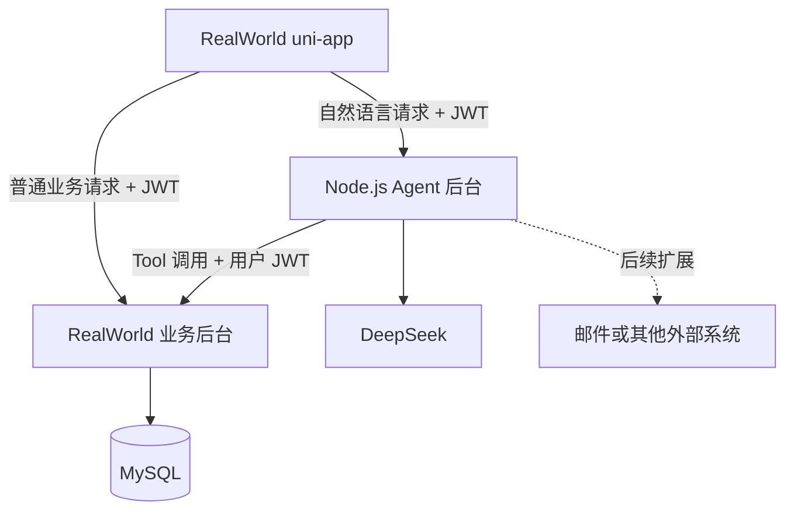
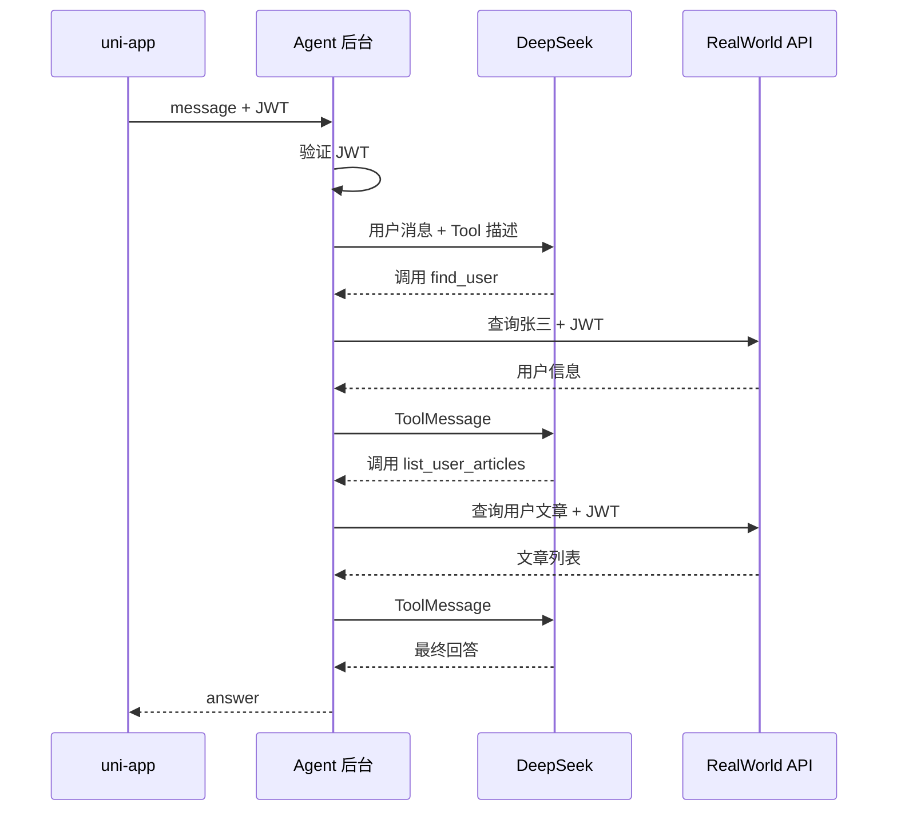

# RealWorld 跨系统 Agent 架构设计

## 1. 项目目标

在现有 RealWorld 项目的基础上增加一个 Agent，让用户可以使用自然语言查询文章、用户、评论、标签、收藏和关注信息，并为以后接入邮件、微信等外部系统保留扩展能力。

本阶段的目标不是构建“什么都能做”的万能 Agent，而是先掌握：

- 独立 Agent 后台如何接入现有业务系统
- Agent 如何通过多个 Tool 调用 RealWorld API
- 前端如何复用现有登录状态和 JWT
- 如何避免用户在多个应用之间频繁跳转
- 如何限制 Agent 的权限和副作用

本阶段暂不考虑：

- RAG
- 会话持久化
- 多 Agent
- 复杂 StateGraph 混合工作流
- 自动发送邮件
- 自动回复个人微信

---

## 2. 核心架构决策

采用以下结构：

```text
一个 RealWorld uni-app 前端
+ 一个独立 RealWorld 业务后台
+ 一个独立 Node.js Agent 后台
```

也就是：

- Agent 后台独立，避免与 RealWorld 后台的技术栈绑定
- Agent 前端嵌入现有 RealWorld uni-app，复用登录、Token、页面和用户体验
- Agent 不直接操作 RealWorld 数据库，通过 RealWorld API 获取业务数据
- 第一版只开放只读 Tool，避免模型误操作业务数据

即使 RealWorld 后台以后由 Express 改成 Java Spring Boot，Agent 后台也不需要重写，只需要保持 API 契约稳定。

---

## 3. 总体架构



三个核心项目：

```text
realworld-frontend
→ uni-app 前端，包含普通页面和 Agent 聊天页面

realworld-backend
→ RealWorld 业务后台，可以使用 Express、Java 或其他技术栈

realworld-agent
→ Node.js + TypeScript + Express + LangChain + DeepSeek
```

---

## 4. 各部分职责

### 4.1 RealWorld uni-app

负责：

- 用户注册和登录
- 保存 JWT
- 普通文章、评论、收藏等页面
- 新增 Agent 聊天页面
- 调用 RealWorld 后台和 Agent 后台
- 展示 Agent 回答、加载状态和错误信息

建议新增：

```text
pages/
└─ agent/
   └─ chat.vue

api/
└─ agent.ts
```

前端配置两个后台地址：

```text
REALWORLD_API_URL
AGENT_API_URL
```

同一个请求封装可以为两个后台统一携带 JWT。

### 4.2 RealWorld 业务后台

负责：

- 用户注册、登录和 JWT 签发
- 用户、文章、评论、标签、收藏、关注业务
- 最终的数据权限判断
- 数据库访问和事务
- 为 Agent 提供稳定的业务 API

Agent 不应该绕过 RealWorld 后台直接操作 MySQL，否则会造成：

- 绕过 Service 业务规则
- Agent 与数据库表结构强耦合
- RealWorld 后台更换技术栈或数据库结构后，Agent 同时需要修改
- 两个后台的数据权限边界混乱

### 4.3 Agent 后台

负责：

- 接收用户自然语言
- 验证 JWT
- 调用 DeepSeek
- 注册和限制可用 Tool
- 根据模型产生的 `tool_calls` 执行 Tool
- 通过 Tool 请求 RealWorld API
- 把工具结果交还模型
- 返回最终自然语言回答

Agent 后台不负责：

- RealWorld 用户注册和登录
- 直接读写 RealWorld 数据库
- 代替 RealWorld 后台做最终业务权限判断
- 在第一版中执行删除、发布、发送等危险操作

---

## 5. 为什么后台独立、前端不独立

后台独立的好处：

- Agent 可以固定使用 Node.js 和 LangChain
- RealWorld 后台可以是 Java、Node.js 或其他技术栈
- Agent 可以单独部署和升级
- DeepSeek Key 只保存在 Agent 后台
- 后续可以连接多个业务系统

前端继续放在 RealWorld 中的原因：

- 复用现有登录页面和 JWT
- 用户不需要在 RealWorld 和 Agent 应用之间跳转
- 复用现有请求封装和页面风格
- Agent 查询结果可以直接与文章页面联动
- 第一版不需要实现 SSO、OAuth 登录回调和跨应用状态同步

因此，后台独立和前端独立不是一回事。一个前端同时调用多个后端是正常架构。

---

## 6. JWT 与身份传递

### 6.1 登录

```text
uni-app
→ 调用 RealWorld 登录接口
→ RealWorld 后台签发 JWT
→ uni-app 保存 JWT
```

### 6.2 调用 Agent

```text
uni-app
→ Authorization: Bearer <JWT>
→ Agent 后台
```

Agent 后台必须验证 JWT，不能只读取其中的用户 ID。

第一版可以让 RealWorld 后台和 Agent 后台共享 JWT Secret。以后如果 RealWorld 使用 Java，可以升级为：

```text
RealWorld 后台使用私钥签发 JWT
Agent 后台使用公钥验证 JWT
```

### 6.3 Tool 调用 RealWorld API

Tool 请求 RealWorld 后台时，继续转发当前用户的 JWT：

```text
uni-app
→ JWT
→ Agent 后台
→ Tool
→ 同一个 JWT
→ RealWorld 后台
```

这样 RealWorld 后台仍然可以根据真实登录用户进行权限判断。

安全原则：

```text
message
→ 用户可以自由输入，不可信

currentUserId / role / authorization
→ 来自 JWT，不允许模型生成
```

---

## 7. Agent 第一版功能

第一版定位为：

> RealWorld 站内内容查询 Agent。

用户可以输入：

```text
查询张三最近发布的文章

看看《Node.js 入门》这篇文章的详情、标签和评论

查询我收藏的文章

我关注的人最近发布了什么
```

Agent 根据需求自动选择一个或多个只读 Tool。

建议第一版提供：

```text
find_user
→ 根据用户名查询用户

search_articles
→ 根据关键词查询文章

list_user_articles
→ 查询指定用户发布的文章

get_article_detail
→ 查询文章详情

list_article_comments
→ 查询文章评论

get_article_tags
→ 查询文章标签

get_my_favorites
→ 查询当前登录用户收藏的文章

get_following_users
→ 查询当前用户关注的人
```

第一版不提供：

```text
create_article
update_article
delete_article
create_comment
delete_comment
favorite_article
follow_user
send_email
```

因为这些操作会产生真实副作用，需要额外的确认、权限、幂等和审计机制。

---

## 8. 一次查询的完整流程

用户输入：

```text
查询张三最近发布的文章
```

执行过程：



用户始终停留在 RealWorld 的 Agent 页面中，不需要进入后台页面或数据库页面。

---

## 9. Agent 后台接口

第一版只需要一个核心接口：

```http
POST /api/agent/chat
Authorization: Bearer <JWT>
Content-Type: application/json
```

请求：

```json
{
  "message": "查询张三最近发布的文章"
}
```

响应：

```json
{
  "success": true,
  "data": {
    "answer": "张三最近发布了3篇文章……"
  }
}
```

本阶段不保存长期对话，所以暂时不要求 `threadId`。

---

## 10. Agent 后台目录建议

```text
realworld-agent/
├─ src/
│  ├─ app.ts
│  │
│  ├─ config/
│  │  └─ env.ts
│  │
│  ├─ middleware/
│  │  └─ auth.middleware.ts
│  │
│  ├─ clients/
│  │  └─ realworld.client.ts
│  │
│  └─ modules/
│     └─ agent/
│        ├─ agent.route.ts
│        ├─ agent.controller.ts
│        ├─ agent.service.ts
│        ├─ agent.ts
│        ├─ agent.schema.ts
│        └─ tools/
│           ├─ find-user.tool.ts
│           ├─ search-articles.tool.ts
│           ├─ get-article-detail.tool.ts
│           ├─ list-comments.tool.ts
│           └─ get-my-favorites.tool.ts
│
├─ .env
├─ package.json
└─ tsconfig.json
```

各层职责：

```text
route
→ 定义 /api/agent/chat

controller
→ 读取 message 和 JWT 用户信息

service
→ 调用 Agent，整理输出

agent.ts
→ 创建模型、注册 Tool、创建 Agent

tools
→ 调用 RealWorld API

realworld.client
→ 统一封装 RealWorld HTTP 请求
```

---

## 11. 跨系统扩展方式

一个 Agent 能否处理多个系统，取决于它是否拥有对应系统的 Tool、API 和授权。

```text
统一 Agent
├─ RealWorld Tools
├─ Email Tools
├─ 微信渠道连接器
├─ 日历 Tools
└─ 其他业务系统 Tools
```

日常执行不要求用户在系统间横跳：

- 用户在 RealWorld 发起请求，结果返回 RealWorld
- 用户从邮件渠道发起请求，结果返回邮箱
- 用户从微信渠道发起请求，结果返回微信

可能需要跳转的情况：

- 第一次绑定外部账号
- OAuth 或扫码授权
- Token 过期后重新登录
- 危险操作需要用户查看并确认

微信能力必须根据公众号、企业微信等具体账号类型核对官方开放接口，不能默认个人微信好友聊天支持任意自动收发。

---

## 12. 邮件功能的后续阶段

邮件功能分阶段实现。

### 第二阶段：生成邮件草稿

```text
用户提出分享文章需求
→ Agent 查询 RealWorld 文章
→ 生成邮件标题和正文
→ 前端展示草稿
→ 用户复制或修改
```

这一阶段不真正发送邮件，风险较低。

### 第三阶段：确认后发送邮件

```text
Agent 查询文章
→ 生成邮件草稿
→ 用户确认收件人、标题和正文
→ Agent 后台调用邮件服务
→ 返回发送结果
```

第一版建议使用系统邮箱发送，不直接接管用户个人邮箱。

---

## 13. 安全边界

必须遵守：

- DeepSeek API Key 只能存放在 Agent 后台
- JWT 必须由 Agent 后台验证
- Tool 不接收由模型生成的 `currentUserId` 和 `role`
- Tool 请求 RealWorld API 时转发用户 JWT
- RealWorld 后台负责最终权限判断
- Agent 第一版只开放只读 Tool
- Tool 参数通过 Zod Schema 校验
- Tool 返回值不能被当作绝对可信的业务结果
- 写操作必须增加用户确认、幂等和审计
- 不使用个人微信非官方协议或模拟点击实现自动聊天

---

## 14. 分阶段实施计划

### 第一阶段：只读查询 Agent

- 创建独立 Agent Express 项目
- 接入 DeepSeek
- 封装 RealWorld API Client
- 实现 JWT 验证和转发
- 实现 3～5 个查询 Tool
- 提供 `/api/agent/chat`
- 在 uni-app 中增加 Agent 聊天页面

### 第二阶段：内容草稿

- 文章摘要
- 评论草稿
- 邮件草稿
- 结构化输出

### 第三阶段：受控写操作

- 用户确认
- 发布评论
- 创建文章
- 发送邮件
- 幂等与审计

### 第四阶段：更多系统连接器

- 邮件 API
- 企业微信或公众号开放能力
- 其他业务系统

---

## 15. 当前最终方案

```text
前端：继续使用现有 RealWorld uni-app，并新增 Agent 页面

业务后台：保持独立，可以是 Express 或 Java

Agent 后台：新建独立 Node.js + Express + LangChain 项目

数据访问：Agent Tool 调用 RealWorld API，不直连 MySQL

身份认证：uni-app 将同一个 JWT 传给两个后台

第一版功能：只读查询文章、用户、评论、标签、收藏和关注

第一版不做：RAG、持久化、邮件发送、微信自动回复、写操作
```

这套架构既能让当前项目快速落地，也为以后接入 Java 后台、邮件和其他系统保留了清晰边界。
